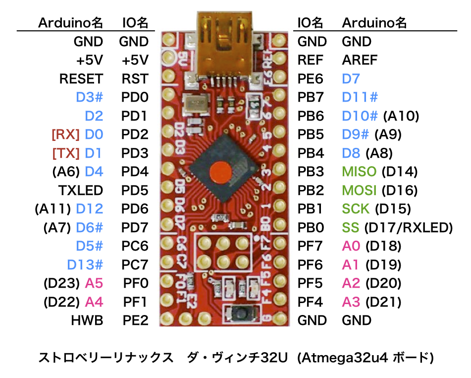

# DaVinci 32U ArduinoIDE設定ツール

[Strawberry Linux の ダ・ヴィンチ32U](https://strawberry-linux.com/catalog/items?code=25005) with Arduino BootloaderをArduinoIDE 1.6.5で利用できるようにします。

# 動作確認環境

* [Strawberry Linux ダ・ヴィンチ32U](https://strawberry-linux.com/catalog/items?code=25005)
* OSX Yosemite, Xcode

# 利用方法

	$ git clone https://github.com/mamemomonga/DaVinci32U-Arduino.git
	$ cd DaVinci32U-Arduino
	$ make
	
生成された DaVinci32U ディレクトリを 書類/Arduino/hardware に入れ、ArduinoIDEを再起動する。

* [ツール] → [ボード] → [Da Vinci 32U] を選択
* [ツール] → [ポート] で新しく出現したポート(だいたい /dev/cu.usbmodemXXXXXX というような名前) を選択

# Blinkスケッチを書き込んでみる
D13はオンボードの赤色LEDになっている。
[ファイル] → [スケッチの例] → [01.Basics] → [Blink] のサンプルを書き込んでチカチカするか確認できる。

# ピン・レイアウト

出典: [TETRASTYLE-dev-BLOG:Leonardo っぽいの](http://dev.tetrastyle.net/2012/02/leonardo.html)

